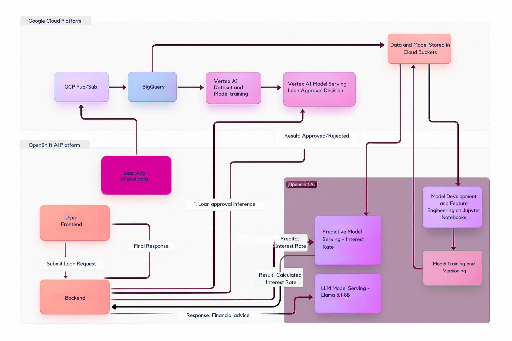
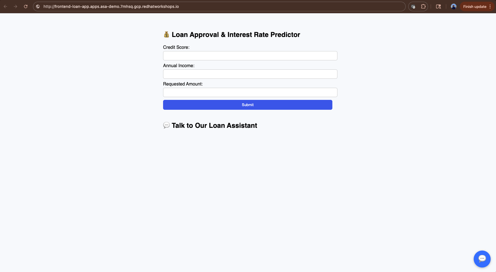

# Hybrid AI Model Orchestration

**This project demonstrates an end-to-end hybrid AI architecture combining Google Vertex AI and OpenShift AI to automate loan decisioning. The frontend collects applicant data and sends it to a backend (FastAPI on OpenShift), which first queries a Vertex AI model for loan approval prediction and confidence scoring. If approved, it then calls an OpenShift AI ONNX model to determine the personalized interest rate. The system integrates seamlessly with a conversational Llama-based chatbot running on Red Hat AI Inference Server to provide applicants personalized financial guidance and loan insights.**

## Architecture Diagram


## Create OpenShift cluster on Google Cloud

* Request GCP Blank Environment on RHDP
* [Follow the steps here to install a Cluster on GCP](https://docs.redhat.com/en/documentation/openshift_container_platform/4.10/html/installing/installing-on-gcp)

## Google Cloud Data Pipeline, Model Training and Inferencing

* Enable Google Cloud API's for artifactory, pub/sub, bigquery
```
gcloud services enable \
  artifactregistry.googleapis.com \
  pubsub.googleapis.com \
  bigquery.googleapis.com \
  aiplatform.googleapis.com
```
* Give the right service accounts correct privileges, for the demo set to admin
* Login to Google Cloud via CLI
``` gcloud auth login ```
* Create Atrifact Registry Repo
```
# Create Artifact Registry repo (if not exists)
gcloud artifacts repositories create asa-demo \
  --repository-format=docker \
  --location=us 

# Authenticate Podman to push
gcloud auth configure-docker us-docker.pkg.dev
```
* Build the [App](loan-data-app) publishing historical loan data and push to artifactory
```
podman build --platform linux/amd64 -t us-docker.pkg.dev/openenv-7mhsq/asa-demo/loan-app:v1 .
podman push us-docker.pkg.dev/openenv-7mhsq/asa-demo/loan-app:v1
```
* [Create a pub/sub topic in GCP](gcloud-manifests/pubsub_topics.json)
```
gcloud pubsub topics create loan-requests
gcloud pubsub subscriptions create loan-requests-sub \
  --topic=loan-requests
```
* Test the app locally and publish messages to pub/sub   
* Create a Namespace to deploy the Application and GCP service account secret in OpenShift
```
oc create ns loan-app
gcloud iam service-accounts create loan-app-sa \
  --display-name="Loan App Service Account"

# Assign required roles
PROJECT_ID="openenv-7mhsq"
for ROLE in roles/aiplatform.user roles/bigquery.admin roles/pubsub.admin; do
  gcloud projects add-iam-policy-binding $PROJECT_ID \
    --member="serviceAccount:loan-app-sa@${PROJECT_ID}.iam.gserviceaccount.com" \
    --role="$ROLE"
done

# Create key file
gcloud iam service-accounts keys create key.json \
  --iam-account=loan-app-sa@${PROJECT_ID}.iam.gserviceaccount.com
oc create secret generic gcp-sa-key --from-file=key.json -n loan-app
```
* Deploy the app on OCP and verify messages are being pushed to pub/sub topic
```
oc apply -f loan-data-app/k8s-manifests/.
```
* [Create Dataset and table Schema in BigQuery](gcloud-manifests/bq_schema.json)
```
# Create dataset
bq --location=US mk -d loan_data

# Create base table
bq query --use_legacy_sql=false \
"CREATE OR REPLACE TABLE \`${PROJECT_ID}.loan_data.loan_data_table\` (
  entity_id STRING,
  entity_type STRING,
  credit_score FLOAT64,
  annual_income FLOAT64,
  requested_amount FLOAT64,
  requested_tenor_months INT64,
  num_past_due FLOAT64
);"
```
* [Create A Subscription to write from Pub Sub to bigquery](gcloud-manifests/pubsub_subscriptions.json)
```
gcloud pubsub subscriptions create $SUBSCRIPTION_ID \
  --topic=$TOPIC_ID \
  --bigquery-table=${PROJECT_ID}:${BQ_TABLE} \
  --use-topic-schema
```
* [Verify table in BigQuery](gcloud-manifests/bq_table.txt)
* Create a table to have a synthetic column for loan\_approval\_status, this is the column where trainig will be done on
* Query for creating table is [here](gcloud-manifests/bq_training_data_table.sql)
```
bq query --use_legacy_sql=false --file=gcloud-manifests/bq_training_data_table.sql)
```
* [Verify the new table in BigQuery](gcloud-manifests/bq_table_trained.txt)
* Create a Tablular type dataset in Vertex AI, Configure the dataset location as the bq table created above
```
# Create dataset
gcloud ai datasets create \
  --region=us-central1 \
  --display-name="loan_dataset_v4" \
  --metadata-schema-uri="gs://google-cloud-aiplatform/schema/dataset/schema-v1.yaml"

# Import data from BigQuery
gcloud ai datasets import-data \
  --region=us-central1 \
  --dataset="loan_dataset_v4" \
  --bigquery-source="bq://${PROJECT_ID}.loan_data.loan_training_data_raw_v3"
```
* Using Vertex AI AutoML train the model on this dataset, Model training target column is loan\_approval\_status.  
* After Model training is done, Deploy the model to an Endpoint in vertex AI
```
# Create endpoint
gcloud ai endpoints create \
  --region=us-central1 \
  --display-name="loan-approval-endpoint"

# Deploy trained model to endpoint
gcloud ai endpoints deploy-model ENDPOINT_ID \
  --region=us-central1 \
  --model=MODEL_ID \
  --machine-type="n1-standard-2"
```
* Modify the query script [here](gcloud-manifests/query.sh) and run the script

## OpenShift AI Model Training and Inference

* Install OCP Service mesh operator  
* Install OCP Serverless Operator
* Install OCP AI from Operatorhub, create Data Science Cluster
```
oc apply -f openshift-ai-manifests/dsc.yaml
oc create ns loan-rate-model
```
* Create Workbench in OpenShift AI in loan-rate-model namespace
* Follow this jupyter [notebook](openshift-ai-manifests/final-train-infer.ipynb) to train and run model locally
* Deploy the model and Serve using OpenShift AI
```
oc apply -f openshift-ai-manifests/InferenceService.yaml
```
* Test the Inference locally using this script
```
python3 openshift-ai-manifests/infer.py
```

## Deploying GPU Enabled Nodes and LLM on AI Inference Server
* We're Choosing 1 Nvidia A100 GPU node in GCP, Add in a new machineset with this instance type. [Sample machineset](openshift-ai-manifests/machineset.yaml)
* Install OpenShift Node Feature Discover Operator
* Create NodeFeatureDiscovery CR
* Install NVIDI GPU Operator
* Create GPU Cluster Policy and gpu-driver CR
* Verify GPU Nodes have been identified and available
```
$ oc get nodes -l feature.node.kubernetes.io/pci-10de.present=true  
NAME                                                       STATUS   ROLES    AGE   VERSION
asa-demo-ddbx4-worker-gpu-xrvfp.c.openenv-7mhsq.internal   Ready    worker   27h   v1.31.8
$ oc get nodes -l nvidia.com/gpu.present=true
NAME                                                       STATUS   ROLES    AGE   VERSION
asa-demo-ddbx4-worker-gpu-xrvfp.c.openenv-7mhsq.internal   Ready    worker   27h   v1.31.8
$ oc describe node asa-demo-ddbx4-worker-gpu-xrvfp.c.openenv-7mhsq.internal | grep -A6 "Capacity"                                  
Capacity:
  cpu:                12
  ephemeral-storage:  267844588Ki
  hugepages-1Gi:      0
  hugepages-2Mi:      0
  memory:             87519172Ki
  nvidia.com/gpu:     1
```
* Deploy Llama 3.1-8B-Instruct Model using vLLM NVIDIA GPU ServingRuntime for KServe
```
oc apply -f openshift-ai-manifests/LLM-InferenceService.yaml
```

## Deploying the Business Application  
* Deploy the backend app to consume both the models
```
cd backend/
podman build --platform linux/amd64 -t us-docker.pkg.dev/openenv-7mhsq/asa-demo/loan-backend-chatbot:v5 .
podman push us-docker.pkg.dev/openenv-7mhsq/asa-demo/loan-backend-chatbot:v5
oc apply -f k8s/.
```
* Test Backend Inference
``` ./infer.sh | jq ```
* Deploy frontend app to connect to the backend
```
cd frontend
oc start-build loan-frontend \                                                                 
  --from-dir=. \  
  --env VITE_BACKEND_URL=http://loan-backend-route-loan-app.apps.asa-demo.7mhsq.gcp.redhatworkshops.io/predict \
  --follow -n loan-app
oc apply -f k8s/.
oc rollout restart deploy/frontend
```
* Make sure backend and frontend pods are healthy
* Go to the frontend route and use http instead of https. Follow this [link](http://frontend-loan-app.apps.asa-demo.7mhsq.gcp.redhatworkshops.io/)

#### Frontend UI

